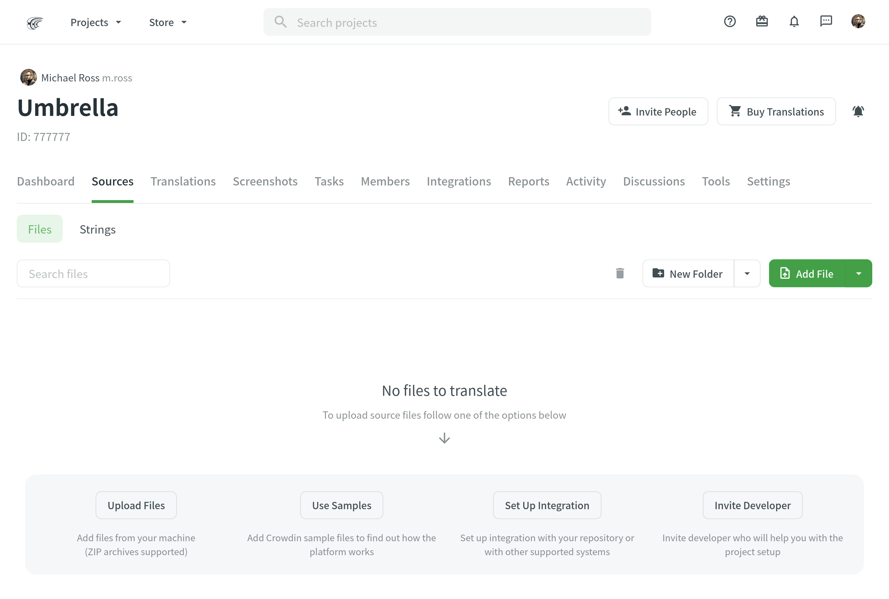
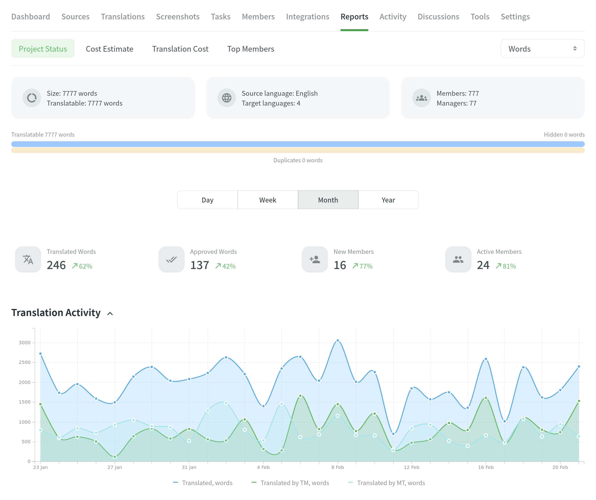

[//]: # (https://support.crowdin.com/translation-process-overview/)

import { CardGrid, Card, LinkCard, Steps, Tabs, TabItem } from '@astrojs/starlight/components';
import { Icon } from 'astro-icon/components';

Crowdin is a localization management platform that helps companies, teams, and individuals stay agile when translating products like mobile, desktop & web apps, websites, games, help documentation, and more.

In this article, we'll walk you through a typical localization workflow.

## Create a Project

<Steps>
  1. [Log in](https://crowdin.com/login) to your Crowdin account or [sign up](https://crowdin.com/join) to create one.

  2. [Create a project](/creating-project) to be able to upload your content for localization. Once you create a project, your free 14-day trial starts.

      When creating a project, you can select the preferred *project visibility*:

      <CardGrid>
        <Card title="Public project" icon="information">
          Searchable via search engines and Crowdin search
        </Card>
        <Card title="Private project" icon="seti:lock">
          Visible only to the invited project members
        </Card>
      </CardGrid>

      Also, you can select the preferred *project type*. You can choose between:

      * <Icon name="mdi:file-document" class="inline-icon" /> **File-based** &ndash; translatable content is managed with source files.
      * <Icon name="mdi:format-list-bulleted" class="inline-icon" /> **String-based** &ndash; translatable content is managed with source strings.

  3. Select the source and target languages (the ones you'll translate your content into).
</Steps>

## Upload Content

Once you've created the project, you can upload localizable files and resources, such as screenshots, translation memory, and glossary.

### Upload Source Files for Localization

Once you've created the project, you can upload localizable files in a way that works best for you:

* Manually via the web interface (UI).
* Integrate Crowdin with the tools you already use. We have over 600 apps and integrations. In Crowdin, you can upload content from:
  * your repo (e.g., GitHub, GitLab, etc.)
  * marketing tools (e.g., Contentful, Webflow, WPML, Kentico Kontent, Hubspot, Marketo, etc.)
  * help center (e.g., Help Scout, Zendesk, Intercom, etc.)
  * development tools (e.g., VS Code, Android Studio, Google Play, etc.)
  * email automation (e.g., MailChimp, SendPulse, ActiveCampaign, Mandrill, Moosend, etc.)
  * design tools (Figma, Adobe XD, Sketch) tools.
* Use [API](https://developer.crowdin.com/api/v2/) or [console client](https://crowdin.github.io/crowdin-cli/).

<Tabs syncKey="projectType">
  <TabItem label="File-based project">
    To upload translatable content in a file-based project, open your project and go to **Sources > Files**:

    
  </TabItem>
  <TabItem label="String-based project">
    To upload translatable content in a string-based project, open your project and go to the **Upload** tab:

    
  </TabItem>
</Tabs>

To automatically sync files between your Crowdin project and the tools of your choice, add and set up the respective integration.

<Steps>
  1. Open your project and go to the **Integrations** tab.

  2. Click **Add Integration**.

  3. Click **Install** on the needed integration and follow the instructions.

  4. Click **Install**.
</Steps>

Once you add the integration, you can proceed to the setup.

<LinkCard
  title="View a list of tools you can integrate with Crowdin"
  href="https://store.crowdin.com"
  target="_blank"
/>

### Upload Existing Translations

If you already have some translations done outside Crowdin, you can upload them to your Crowdin project to keep everything in one place and continue working on translations.

<LinkCard
  title="Read more about Uploading Existing Translations"
  href="/uploading-translations"
/>

### Upload Localization Resources

In most cases, you might have localization resources like [Translation Memory](/translation-memory) and [Glossary](/glossary). It is a good idea to upload them to your Crowdin project since these localization resources help your translators during the translation process and ensure high translation quality.

### Upload Screenshots and Add Context

[Screenshots](/screenshots) are another great way to provide additional context so translators can understand better how they should translate the source strings. To upload screenshots, open your project and go to the **Screenshots** tab. Tag the source strings on the screenshots. This way, screenshots with tagged strings will appear under each string in the Editor's Context section.
Read more about [context features in Crowdin](https://crowdin.com/blog/2019/11/05/no-context-no-quality-give-translators-context-to-get-better-translations).

<LinkCard
  title="Translate Your UI with Crowdin's Screen Translation Feature"
  description="Crowdin's Screen Translation simplifies UI localization by allowing users to translate interface elements with a real-time preview of your app design."
  href="https://crowdin.com/translate-ui-with-crowdin"
/>

## Pre-translate your Project

To save time, you can pre-translate your Crowdin project via [Translation Memory](/translation-memory) (TM) or [Machine Translation](/machine-translation) (MT). This way, you'll have some strings automatically translated before translators start working on your project translations. You can apply pre-translation manually or set up automatic pre-translation via [TM](/project-settings/translation-memories) or [MT](/project-settings#machine-translation), so each time new content is added, it's translated automatically.

## Invite Project Members

Decide who will translate your content. You can cooperate with professional translation agencies integrated with Crowdin or invite your own team of translators if you have one. If you decide to work with professional translation agencies, open **Store > Vendors** and select the translation vendor that meets your requirements.

If you decide to [invite your own team of translators](/team-management), open your project and go to the **Members** tab. You can invite people to your project using their Crowdin username or email address and via the invitation link. When inviting new people, you can assign them the following roles: Manager, Language Coordinator, Proofreader, and Translator. You can [change the assigned role](/team-management) for any project member at any time.

Once new members join your project, they can start translating the content in the [Editor](/online-editor).

## Generate Reports

Crowdin Reports give you an overview of all the important data regarding your project.

There are five main types of reports you can find under the **Reports** tab in your project:

* Project Status
* Costs Estimate
* Translation Cost
* Top Members

<LinkCard
  title="Read more about Reports"
  href="/project-reports"
/>

## Download Translations

Translations are downloaded according to the export settings configured in the project's **Settings** tab.

You can download translations manually using the web interface, using integrations (e.g., [GitHub](/github-integration) or similar), applying [API](https://developer.crowdin.com/api/v2/), or using a [console client](https://crowdin.github.io/crowdin-cli/) to automate the translation download.

<LinkCard
  title="Read more about Downloading Translations"
  href="/downloading-translations"
/>
