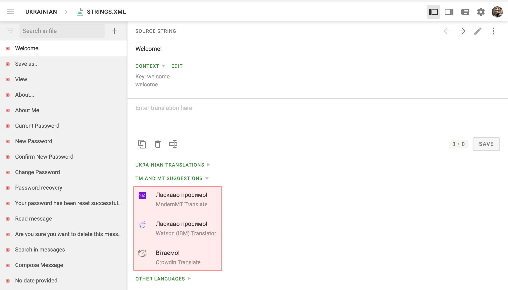

[//]: # (https://support.crowdin.com/configuring-machine-translation-engines/)

import { Steps, Aside, LinkCard } from '@astrojs/starlight/components';

Machine translation engines integrated with Crowdin provide translation suggestions from automatic translation services like Google Translate and AutoML Translation, Microsoft Translate, and more.

Suggestions made by machine engines are displayed in the Editor under the translators’ suggestions field. Also, you can do [Pre-Translation](/pre-translation) using MT engines.

<LinkCard
  title="Add More Machine Translation Engines"
  description="Install more machine translation engines from the Crowdin Store."
  href="https://store.crowdin.com/tags/machine-translation"
  target="_blank"
/>

By default, machine translations are enabled for each project, but it is required to configure the translation engines before the project members can use them. If you want to disable this option for specific projects, clear **Show machine translation suggestions** in [Project Settings](/project-settings).

To configure the machine translation engines, follow these steps:

<Steps>
  1. Open your profile home page and go to the **Machine Translation** tab.
  2. Fill in the credentials of the preferred translation engine.
  3. Click **Update**.
</Steps>

<Aside type="caution">
  Machine translation engines must be configured using the project owner's account.
</Aside>

### Microsoft Translator

Go to [Windows Azure](https://portal.azure.com/#blade/HubsExtension/BrowseAll) to access your Microsoft Translator API subscription key. Translator Text API offers a free tier with 2,000,000 translated characters.

<Aside>
  If the *Resource Location* associated with your Microsoft Translator Text API key is other than *global*, please make sure to specify it along with other credentials while configuring the Microsoft Translator MT engine in your Crowdin account.
</Aside>

<LinkCard
  title="How to sign up for the Microsoft Translator Text API"
  href="https://docs.microsoft.com/en-us/azure/cognitive-services/translator/translator-text-how-to-signup"
  target="_blank"
/>

### DeepL Translator

DeepL API is accessible only with the DeepL API Free and Pro subscription plans ([For developers](https://www.deepl.com/pro.html#developer) tab). Navigate to the [DeepL Pro Account page](https://www.deepl.com/pro-account.html) to get a unique Authentication Key. Please note that the DeepL API plan is the only plan that provides this feature.

If you’re subscribed to a different subscription plan, you can switch to the DeepL API plan in your [personal account settings](https://www.deepl.com/pro-account.html). DeepL also provides a [simulator](https://www.deepl.com/docs-api/simulator) that allows you to check your Authentication Key in action.

### Watson (IBM) Translator

Watson (IBM) Translator offers 1,000,000 characters per month free of charge and paid plans to select from after exceeding the limit. Go to the [Watson (IBM) Services Console](https://cloud.ibm.com/catalog/services/language-translator) to get your Watson Translator API key.

### ModernMT

ModernMT Real time translation API is accessible with the Real time or Human-in-the-loop subscription plans. Navigate to the [ModernMT Dashboard](https://www.modernmt.com/dashboard/) to get your License key. If you’re subscribed to a different subscription plan, you can switch to the Real time or Human-in-the-loop plan via the [Manage Plan](https://www.modernmt.com/dashboard/manage-plan) page.

### Amazon Translate

The free version of Amazon Translate is available for 12 months. Afterward, you will need to pay for the number of characters translated. Crowdin uses Standard Text Translation type provided by Amazon Translate. Read more about [available Amazon Translate pricing options](https://aws.amazon.com/translate/pricing/).

Read more about [obtaining your access key](https://docs.aws.amazon.com/general/latest/gr/aws-sec-cred-types.html#access-keys-and-secret-access-keys) needed for Amazon Translate integration.

To use your [Custom Terminology](https://docs.aws.amazon.com/translate/latest/dg/how-custom-terminology.html), follow these steps:

<Steps>
  1. Specify your AWS Region (e.g., us-east-2).
  2. Select your Custom Terminology from the respective drop-down menu.
</Steps>

### Google Translate

To use Google Translate, you shall have a Google Cloud account with an active billing profile. Cloud Translation is priced monthly based on usage. [Learn more](https://cloud.google.com/translate/pricing).

To obtain the API key necessary for integration, follow these steps:

<Steps>
  1. Go to [Google Cloud Console](https://console.cloud.google.com/). Log in to the existing Google Cloud account or set up a new one.

  2. Select an existing project or add a project using the **New Project**.

  3. Go to [API & Services > Library](https://console.cloud.google.com/apis/library) and search for *Cloud Translation API*.

  4. Click **Enable**.

  5. Go to [API & Services > Credentials](https://console.cloud.google.com/apis/credentials/) and click **Create credentials > API key**.

  6. Copy the API key and click **Close**.
</Steps>

### Google Cloud AutoML Translation

To use AutoML Translation, you shall have a Google Cloud account with an active billing profile. Google AutoML Translation is priced monthly based on how many characters you send for translation. [Learn more](https://cloud.google.com/translate/automl/pricing#translation_costs).

To create a service account key and obtain the necessary credentials for integration, follow these steps:

<Steps>
  1. Go to [Google Cloud Console](https://console.cloud.google.com/). Log in to the existing Google Cloud account or set up a new one.

  2. Select an existing project or add a project using the **New Project**.

  3. Go to [API & Services > Library](https://console.cloud.google.com/apis/library) and search for *Cloud AutoML API*.

  4. Click **Enable**.

  5. The next step is to create a service account private key pair. The service account is used by Crowdin. Applications use service accounts to make authorized API calls.
</Steps>

To set up authentication and create your private key, follow these steps:

<Steps>
  1. Go to [API & Services > Credentials](https://console.cloud.google.com/apis/credentials/).

  2. Click **Create credentials > Service account**.

  3. In the *Service account name* field, enter a name that describes what this service account will do.

  4. Click **Create and continue**.

  5. From the *Role list*, select *Project* > *Cloud Translation API Editor* and click **Continue**.

  6. Click **Done**.

  7. In the [API & Services > Credentials](https://console.cloud.google.com/apis/credentials/), click on the created service account.

  8. Switch to the **Keys** tab.

  9. Click **Add key > Create new key**.

  10. Select **JSON** and click **Create**. A JSON file that contains your key will be downloaded to your computer.
</Steps>

#### Google Cloud AutoML Custom Glossary Configuration

Google Cloud AutoML custom glossary allows you to translate your domain-specific terminology consistently.

To configure your Google Cloud AutoML custom glossary, follow these steps:

<Steps>
  1. Open **Resources** and select **Machine Translation**.

  2. In the Google AutoML Translation section, upload your JSON credentials.

  3. Specify your Resource Location (e.g., us-central1).

  4. Select your Glossary from the respective drop-down menu.

  5. (Optional) Specify your Custom Model. If needed, configure language mapping between Custom Model and Crowdin languages.
</Steps>

## MT Engine IDs

Once you specify your MT engine credentials, the system automatically assigns a unique MT engine ID. Later on, you can use these IDs in API requests for pre-translation via machine engines.

You can find the MT engine ID on the **Machine Translation** tab of your profile after opening the engine details.

Alternatively, you can also [get your MT engine IDs via API](https://developer.crowdin.com/api/v2/#operation/api.mts.getMany).

## See Also

-   [Pre-Translation](/pre-translation)
-   [Project Settings](/project-settings)
