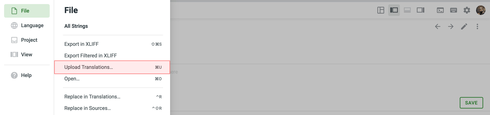

[//]: # (https://support.crowdin.com/uploading-translations/ + https://support.crowdin.com/uploading-translations-sb/)

import { Aside, LinkCard, Tabs, TabItem } from '@astrojs/starlight/components';
import { Icon } from 'astro-icon/components';
import ReadMore from '~/components/ReadMore.astro';

If you have existing translations ready to integrate into your Crowdin project, you can upload them directly. Navigate to your project's settings where you can import these translations.

For file-based projects, this can be done through the **Translations** tab or directly from a specific file in the Editor. For string-based projects, use the **Upload** tab or access the target language in the Editor to upload XLIFF translations.

The best practice is to upload translated files with the key-value structure.

<ReadMore>
  Read More about [project types](/creating-project#project-types) in Crowdin.
</ReadMore>

## Uploading Translations via Project page

To upload translations to your project, follow these steps:

<Tabs syncKey="projectType">
  <TabItem label="File-based project">
    1. Open your project and go to the **Translations** tab.

    2. Click **Upload existing translations** to expand the respective section.
       

    3. Drag and drop files from your machine, or click **Select Files**. You can upload ZIP archives to add multiple folders and files.

    4. Crowdin automatically matches uploaded translations with appropriate source files and languages. Check it manually to make sure everything is matched correctly.
       

    5. (Optional) Click the <Icon name="mdi:cog" class="inline-icon"/> button under the uploaded file list to view the advanced import settings.

       <Aside>
         By default, translations that match the source strings, translations that are identical to the existing ones, and translations for hidden strings are skipped during the upload.
       </Aside>

    6. Click **Import** to apply the translations to the source files.

    <Aside type="tip">
      You can also upload translations via the [online editor](/online-editor): open the necessary file in the Editor, click on the Main menu <Icon name="mdi:menu" class="inline-icon"/> in the upper-left corner, and go to **File** > **Upload Translations**.
    </Aside>
  </TabItem>

  <TabItem label="String-based project">
    1. Open your project and go to the **Upload** tab.

    2. Drag and drop files from your machine, or click **Select Files**. You can also upload ZIP archives if you want a set of files to be added.

    3. Crowdin automatically tries to detect the target language to which you're uploading translations. Check it manually to make sure target languages are matched correctly towards translation files.

    4. (Optional) In the **Translations** section, to the right of the uploaded file list, configure advanced translation import settings.

    5. Click **Upload** to apply translations to the source strings.
       

       <Aside>
         By default, translations are uploaded as unapproved, translations that match the source strings, and translations for hidden strings are skipped during the upload.
       </Aside>
  </TabItem>
</Tabs>

## Uploading XLIFF Translations

You can do the offline translation for all file formats and strings by downloading existing content in the XLIFF format; once the offline translations are finished, use **Upload XLIFF Translations** or **Upload Translations**.

To upload XLIFF translations for a specific target language, follow these steps:

<Tabs syncKey="projectType">
  <TabItem label="File-based project">
    1. Select the language on the project page.

    2. Click <Icon name="heroicons:arrows-up-down-solid" class="inline-icon"/> and select **Upload XLIFF Translations**.
       
  </TabItem>
  <TabItem label="String-based project">
    1. Select the language on the project page to open it in the Editor.

    2. Click on the Main menu <Icon name="mdi:menu" class="inline-icon"/> in the upper-left corner.

    3. Go to **File > Upload Translations**.
       
  </TabItem>
</Tabs>

## Key-value Formats

You can easily upload translations for source files with a key-value structure.

This includes the following file formats: Android XML, macOS/iOS Strings, Stringsdict, JSON, Chrome JSON, GO JSON, i18next JSON, FBT JSON, XLIFF, XLIFF 2.0, Java Properties, Play Properties, Java Properties XML, RESX, RESW, RES JSON, YAML, INI, Joomla INI, JS, FJS, PO, TS, QT TS, Blackberry, Symbian, Flex, BADA, TOML, Coffee, DKLANG, XAML, SRT, VTT, VTT2, SBV, SVG, DTD, CSV, RC, WXL, Maxthon, Haml, XLSX, PLIST, PHP, ARB, VDF.

The system maps uploaded translations according to the string keys.

## Text and HTML-based Formats

For files that do not have a defined structure, translation upload is handled by an experimental machine learning technology.

This includes the following file formats: HTML, Front Matter HTML, Markdown, Front Matter Markdown, TXT, Generic XML, Web XML, DOCX, HAML, IDML, DITA, Wiki, FLSNP, MIF, and ADOC.

To achieve the best results, we recommend uploading translation files with the same or as close as possible file structure as in source files.

Currently, this feature is available for the following languages (not depending on the language pair combination): Arabic, Chinese Simplified, Chinese Traditional, English, French, German, Italian, Japanese, Korean, Dutch, Polish, Portuguese, Portuguese Brazilian, Spanish, Thai, Turkish, and Russian.

<LinkCard
  title="Try Document Aligner application"
  description="Translation alignment, facilitated by the app, allows you to upload existing translations of non-key-value documents to Crowdin or create an editable XLSX Translation Memory, enhancing the efficiency and accuracy of your translations."
  href="https://store.crowdin.com/aligner"
  target="_blank"
/>
